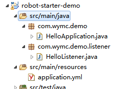
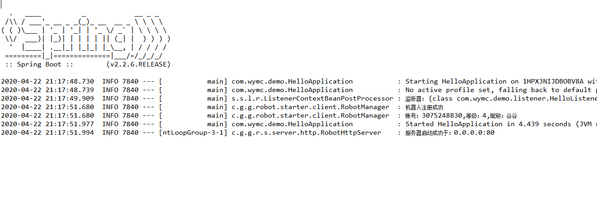

# 基于netty和springboot的机器人框架

> 需要cqhttp插件支持

## 快速开始

因为本框架依赖于springboot，如果了解springboot，那么更容易理解文档中的说明，如果不懂，那也没关系。

### 安装cqhttp

如果可能，请先阅读：[cqhttp的安装使用方法](https://cqhttp.cc/docs/4.14/#/?id=%E4%BD%BF%E7%94%A8%E6%96%B9%E6%B3%95)

- 前往酷Q[官方下载地址](https://cqp.cc/t/23253)下载酷Q应用，并安装。

- 安装cqhttp插件

  **①.** 前往`CQ HTTP API`的 [releases ](https://github.com/richardchien/coolq-http-api/releases)下载最新版本。
  **②.** 将下载好的`.cpk`格式文件移动至`酷Q`根目录下的`/app`文件夹下。
  **③.** 启动一次酷Q程序，右键酷Q标志，选择：`应用 > 应用管理`，如图所示：

  

  

### java端开发

CQHttp配置，打开coolq安装路径下的`data\app\io.github.richardchien.coolqhttpapi\config`目录，配置`账号.json`文件，`账号`是你要登陆coolq的机器人qq账号。下面这段是必须配置，其他暂时不列出来。

如果你不知道怎么配置，你可以删除将下面的配置直接覆盖掉里面的内容

```json
{
  "host": "0.0.0.0",
  "port": 5700,
  "use_http": true,
  "post_url": "http://127.0.0.1:80"
}
```

```xml
<dependencies>
	<dependency>
		<groupId>com.github.guigumua</groupId>
		<artifactId>robot-starter</artifactId>
		<version>1.0.2</version>
	</dependency>
</dependencies>
```

#### 0基础maven快速开始

如果你有任何maven项目的开发经验，你可以复制maven坐标后直接跳过这段

新建一个maven项目


勾选创建简单项目


为项目命名


打开项目中的pom文件，将下面的依赖复制到`project`标签下：

```xml
<dependencies>
	<dependency>
		<groupId>com.github.guigumua</groupId>
		<artifactId>robot-starter</artifactId>
		<version>1.0.2</version>
	</dependency>
</dependencies>
```

如图：


完成后，`eclipse`按`alt+f5`后直接`enter`刷新maven依赖。完成后，项目的结构如图，会多出一个`maven dependencies`：


然后，在`src/main/resources`下新建一个`application.yml`文件。（eclipse这方面的操作比较脑瘫，建议选中`src/mian/resources`后，按下`alt+enter`，点击下图所示的图标，跳转到文件浏览器，然后新建文件。


新建完成后，选中`src/main/resources`按`f5`刷新，可以看到目录下多了个`application.yml`文件，打开它，复制下面的配置项到其中去。

application.yml配置

```yaml
robot:
   client:
      host: 127.0.0.1
      port: 5700
```

如果你不懂`YAML`这种语法，你可以先学习一下。或者使用`application.properties`文件来取代`application.yml`，同时，里面的写法改成如下的结构：

```properties
robot.client.host=127.0.0.1
robot.client.port=80
```

相信你能够看懂他们之间的关系。

到这里配置就完成了，下面是java的代码。

在`src/main/java`下`ctrl+N`新建包和类。你也可以新建包后直接复制下面的代码，在包上粘贴eclipse会自动新建类。

启动类

```java
package com.wymc.demo;

import org.springframework.boot.SpringApplication;
import org.springframework.boot.autoconfigure.SpringBootApplication;

@SpringBootApplication
public class HelloApplication {
	public static void main(String[] args) {
		SpringApplication.run(HelloApplication.class, ars);
	}
}
```

此时，java这边已经能够正常启动，但你还没有编写任何功能。我们可以写一些监听器来完成想要的功能。

监听器

```java
package com.wymc.demo.listener;

import org.springframework.stereotype.Component;

import com.github.guigumua.robot.common.client.RobotClient;
import com.github.guigumua.robot.common.event.EventType;
import com.github.guigumua.robot.common.event.message.PrivateMessageEvent;
import com.github.guigumua.robot.starter.annotation.Filter;
import com.github.guigumua.robot.starter.annotation.Listener;

@Component
public class HelloListener {

	@Listener(EventType.PRIVATE_MESSAGE)
	@Filter("^hello.*")
	public void hello(PrivateMessageEvent event, RobotClient client) {
		client.sendPrivateMsg(event.getUserId(), event.getMessage());
	}
}
```

结构如图：



`HelloListener`可以不在`com.wymc.demo.listener`目录下，但是必须在`HelloApplication`所在包的同级或子级目录下，否则，你需要另外的配置。

在上文中的启动类上右键run as ->java application即可启动你的机器人。




### 理解快速开始项目

首先，你要了解cqhttp的工作原理。

#### 事件上报

事件：是指coolq端接收到的聊天消息内容、好友请求、群管信息、文件上传等等信息。

事件上报：coolq端将事件通过http或者websocket发送到配置文件中指定的地址。

在前文提到的`账号.json`文件中，增加一项`"log_level": debug`的配置，可以看到事件上报的详细内容。如图：


如果你和我有一点不同也不要担心，我开启了websocket的事件上报。

根据cqhttp的官方文档的说明，在`post_url`中指定的就是http的事件上报的地址。

[事件上报详细内容](https://cqhttp.cc/docs/4.14/#/Post)

#### CQHTTP接口

cqhttp为我们提供了一些用来主动进行消息发送、群管理、获取信息的接口。默认使用的是http服务器，也就是`use_http`这项配置，`port`是配置http服务器的端口，`host`是允许接收的连接的ip/域名。

[cqhttp api详细内容](https://cqhttp.cc/docs/4.14/#/API)

#### 事件服务器

事件上报在http的情况下，相当于发送了一个http的请求，而且都是POST请求，请求体的内容就是事件。那么显而易见的，我们可以编写一个http服务器来处理这些请求，称之为事件（处理）服务器。

你可以通过`robot.server`的配置来配置这个服务器。

| 配置项              | 默认值  | 含义                                                     |
| ------------------- | ------- | -------------------------------------------------------- |
| `robot.server.host` | 0.0.0.0 | 允许接收的事件上报的地址，默认代表所有                   |
| `robot.server.port` | 80      | 接收事件上报的端口，请与cqhttp配置中的`post_url`端口对应 |

#### 机器人客户端

上面提到`CQHTTP`的接口，与之对应的，机器人客户端就是实现了访问这个接口的一个客户端，你可以调用里面的方法，来访问`CQHTTP`的接口。每一个机器人客户端都对应一个coolq端。

所有配置都在`robot.client`之下，可以支持配置多个机器人客户端配置（连接不同的cqhttp的接口服务端）。

如果你使用的是全局客户端配置，那么被注册的这个机器人客户端将交给spring容器进行管理。也就是说，你可以在任何能够使用依赖注入的地方注入`RobotClient`即可得到他。

| 配置项                         | 默认值    | 含义                     |
| ------------------------------ | --------- | ------------------------ |
| `robot.client.host`            | 无        | 全局客户端host           |
| `robot.client.port`            | 无        | 全局客户端端口           |
| `robot.client.clients`         | 无        | 机器人客户端配置的列表   |
| `robot.client.clients[i].host` | 127.0.0.1 | cqhttp接口服务端所在host |
| `robot.client.clients[i].port` | 5700      | cqhttp接口服务端所在端口 |

#### 监听器

监听器：当事件被事件服务器接收到时，用来处理这个事件的方法。

事件与监听器直接存在一个映射关系，不是所有的事件都会由所有的监听器来执行，你需要定制监听器在什么样的事件和其他条件下才能够执行。这称之为事件到监听器的映射。

通过`@Listener`注解，我们可以定义一个监听器，有监听器的类需要`@Component`注解，以注入spring容器方便管理。事实上，如果你没有将类注入到容器，监听器是无法被加载的。

显而易见的，`@Listener`注解上的`EventType`枚举类型，是对事件类型的封装，他能够指定监听器所监听的事件类型。`EventType.PRIVATE_MESSAGE`代表的是私聊类型的消息。而`@Filter`注解定义了能够触发监听器的消息的正则表达式。

监听器上的参数`PrivateMessageEvent`是对事件的封装，`RobotClient`是前文提到的用于访问CQHTTP接口的类。

说到这里相信你应该已经完全理解了这个demo的原理，如果不理解那就再看一遍><

## 事件

事件本质是POST请求，请求体是一个JSON。

事件可以被分为三个大类`message`,`notice`,`request`，在json中以`post_type`表明，对应的还会有一个字段用来说明事件的基本类型。比如`post_type`是`message`的，他将有一个`message_type`的字段说明事件类型。同理，`notice`对应`notice_type`，`request`对应`request_type`。

我将事件类型封装成了`EventType`枚举类，code如下：

```java
public enum EventType {
	PRIVATE_MESSAGE("message_private", 1),
	GROUP_MESSAGE("message_grou", 1 << 1),
	DISCUSS_MESSAGE("message_discuss", 1 << 2),
	MESSAGE("message", (1 << 3) - 1),
	GROUP_UPLOAD_NOTICE("notice_group_upload", 1 << 3),
	GROUP_ADMIN_NOTICE("notice_group_admin", 1 << 4),
	GROUP_DECREASE_NOTICE("notice_group_decrease", 1 << 5),
	GROUP_INCREASE_NOTICE("notice_group_increase", 1 << 6),
	GROUP_BAN_NOTICE("notice_group_ban", 1 << 6),
	FRIEND_ADD_NOTICE("notice_friend_add", 1 << 7),
	NOTICE("notice", (1 << 8) - 1 ^ (1 << 3) - 1),
	FRIEND_REQUSET("request_friend", 1 << 8),
	GROUP_REQUEST("request_group", 1 << 9),
	REQUEST("request", (1 << 10) - 1 ^ (1 << 8) - 1 ^ (1 << 3) - 1),
	ALL("event", (1 << 10) - 1),;
	/**其他代码**/
}
```

所有事件都实现了`Event`接口，`Event`接口提供了所有事件的通用方法。而`MessageEvent`、`NoticeEvent`、`RequestEvent`是三种事件分类的抽象实现，提供每个分类通用方法。事件实体类总共有十一种实现类。

事件实体类的命名方式是：`{类型}{分类}{Event}`的方式，比如私聊类型的消息的`message_typ`是`private`，大分类是`message`，它对应的实体类是`PrivateMessageEvent`，同理群聊消息是`GroupMessageEvent`，其他请结合CQHTTP文档。

## 监听器注解

### @Listener

前文提到了`@Listener`注解，现在来看看源码：

```java
@Target({ ElementType.METHOD, ElementType.ANNOTATION_TYPE })
@Retention(RetentionPolicy.RUNTIME)
@Documented
public @interface Listener {
	/**
	 * 监听类型，默认监听所有
	 * @return 需要监听的事件类型的数组
	 */
	@AliasFor(attribute = "value")
	EventType[] type() default EventType.ALL;

	@AliasFor(attribute = "type")
	EventType[] value() default EventType.ALL;

	/**
	 * 监听器执行优先级，数值越大优先级越低
	 * @return 数值表示的优先级
	 */
	int sort() default Integer.MAX_VALUE;

	/**
	 * 当这个监听器执行完成后，是否跳过优先级在之后的其他监听器的执行
	 * @return 是否跳过其他监听器执行
	 */
	boolean isBreak() default false;
}
```

在这里，`type`和`value`的配置效果完全一样。（基于spring的`@AliasFor`实现）

而`sort`是定义这个监听器的执行优先级。因为一个事件，可能能够映射到多个监听器，这些监听器之间会存在一个顺序关系，你可以用这个方法来决定监听器执行的顺序。

`isBreak`是定义这个监听器执行完成后，是否跳过优先级在这个监听器之后的监听器的执行。

### @Filter

```
@Target(ElementType.METHOD)
@Retention(RetentionPolicy.RUNTIME)
@Documented
public @interface Filter {
   /**
    * 监听消息的正则数组
    * @return 正则数组
    */
   @AliasFor(attribute = "value")
   String[] regex() default ".*";

   /**
    * 同regex
    * @return 同regex
    */
   @AliasFor(attribute = "regex")
   String[] value() default ".*";

   /**
    * 群号列表
    * @return 群号
    */
   long[] group() default {};

   /**
    * qq号列表
    * @return QQ号
    */
   long[] qq() default {};

   /**
    * 匹配方式
    * @return 匹配方式
    */
   MatchType[] matchType() default MatchType.ANY_REGEX;
   
   /**
	 * 多匹配方式的处理逻辑
	 * 
	 * @return
	 */
	MatchTypeModel matchTypeModel() default MatchTypeModel.ANY;
   /**
    * 拦截器列表
    * @return 拦截器列表
    */
   Class<? extends ListenerFilter>[] filters() default {};
}
```

`regex`与`value`配置相同，是定义监听器映射的事件的聊天消息内容将会匹配的正则。如果一个事件不是聊天消息类型的事件，默认情况下会返回true

`group`和`qq`是定义监听器映射的事件的有关群号和qq号码的待选列表。每个事件都有一个`userId`字段，`qq`将会匹配的是这个字段，但在不同的事件中，这个字段的含义有所不同。而在群内发生的事件都会有一个`groupId`字段，`group`将会匹配的是这个字段。

### MatchType

这是一个枚举类型，定义了多种匹配方式。支持定义多个匹配方式，但含义上明显相悖的不应该同时使用，虽然不会报错，但会导致你的监听器一直被拦截无法执行。

| 实例                    | 含义                                                         |
| ----------------------- | ------------------------------------------------------------ |
| `ANY_REGEX`             | `regex`数组中**有任何**正则能够匹配到消息内容时通过          |
| `NONE_REGEX`            | `regex`数组中**没有任何**正则能够匹配到消息内容时通过        |
| `ALL_REGEX`             | `regex`数组中**所有**正则能够匹配到消息内容时通过            |
| `INCLUDE_QQ`            | `qq`数组中**有任何**qq号码能匹配到事件中的`userId`时通过     |
| `EXCLUDE_QQ`            | `qq`数组中**没有任何**qq号码能匹配到事件中的`userId`时通过   |
| `INCLUDE_GROUP`         | `group`数组中**有任何**群号码能匹配到事件中的`groupId`时通过，如果是没有这个字段的事件，则不通过 |
| `EXCLUDE_GROUP`         | `group`数组中**没有任何**群号码能匹配到事件中的`groupId`时通过，如果是没有这个字段的事件，则通过 |
| `CONTAIN_AT`            | 消息内容中包含@时通过                                        |
| `CONTAIN_AT_SELF`       | 消息内容中包含@机器人时通过                                  |
| `CONTAIN_AT_QQ`         | `qq`数组中**有任何**qq匹配到被@的qq号码时通过                |
| `ANY_REGEX_EXCLUDE_CQ`  | `regex`数组中**有任何**正则匹配到移除cq码后的消息内容时通过  |
| `ALL_REGEX_EXCLUDE_CQ`  | `regex`数组中**所有**正则匹配到移除cq码后的消息内容时通过    |
| `NONE_REGEX_EXCLUDE_CQ` | `regex`数组中**没有任何**正则匹配到移除cq码后的消息内容时通过 |
| `ONLY_IMAGE`            | 接收到的消息**只有**图片                                     |

#### 多匹配模式

上面的`MatchType`定义了一些能够简化开发的匹配模式，但他们之间的组合依然不够灵活，于是我定义了一个用来组合多种`MatchType`的枚举类。

| 枚举                  | 含义                    |
| --------------------- | ----------------------- |
| `MatchTypeModel.ANY`  | 任何一个`MatchType`通过 |
| `MatchTypeModel.NONE` | 没有任何`MatchType`通过 |
| `MatchTypeModel.ALL`  | 所有`MatchType`通过     |

## CQ码

`cq码`是coolq官方定义的一种具有特殊功能的代码。[coolq官方文档](https://docs.cqp.im/manual/cqcode/)

cqhttp对其进行了一定程度的增强。[文档。](https://cqhttp.cc/docs/4.15/#/CQCode)

通过这种代码，你可以实现发送图片、语音、表情、及其他特殊功能。

在框架内，`CQ码`对应的实现类是`CQCode`，其中包含了获取各种不同功能的`CQCode`的方法，以及从消息中获取`CQCode`的方法等等。

## 事件处理流程

每个事件，在框架内的处理都会经过以下流程

- **解析**

  ·将http请求或者websocket帧解析为事件实体对象。

- **注册机器人客户端**

  通过上报信息来注册机器人客户端，如果已经存在，则跳过

- **获取监听器序列**

  通过`EventType`和`@Filter`注解的正则，以及`@Filter`注解上的`filters`配置中的所有实现了`MappingFilter`接口的类的逻辑，来找到匹配的监听器的集合

- **参数注入**

  通过上下文对象，获取参数的类型自动的注入参数，目前会注入的类型包括：`Event`类型，`RobotClient`类型以及所有在spring容器中存在的类型。

- **执行前拦截**

  根据`@Filter`注解上的`filters`中任何实现`PreFilter`的类决定是否执行监听器

- **执行监听器**

  调用执行监听器，并返回结果（如果监听器返回值不为void）

- **执行后拦截**

  根据`@Filter`注解上的`filters`中任何实现`PostFilter`的类决定是否执行后续逻辑。

  目前，只能拦截是否执行`@Listener`注解上的`isBreak`和结果处理。

- **结果处理**

  处理监听器执行返回值。通常，这一步是通过返回响应来完成发送消息等简单逻辑。

## 拦截器

框架内定义了三种拦截器，都继承自`ListenerFilter`

```java
public interface ListenerFilter {
	/**
	 * 拦截器接口定义
	 * 
	 * @param event   事件
	 * @param context 监听器上下文
	 * @param args    将来可能进行拓展
	 * @return
	 */
	boolean apply(Event event, ListenerContext context, Object... args);
	/**
	 *
	 * @return 越大优先级越低
	 */
	default int order() {
		return Integer.MIN_VALUE;
	}
}
```

其中，`ListenerContext`是一个包含了监听器详细信息的上下文对象。

现在，拦截器也存在优先级，你可以通过重写`order`返回的值来定制拦截器执行的优先级。

### MappingFilter

这个拦截器定义从事件到监听器的映射，也就是说，当一个监听器监听的事件发生时，是否将这个事件交给监听器处理。目前，这个监听器中的`args`参数依然为空。

### PreFilter

当得到事件映射的监听器序列后，执行前的拦截器。这个拦截器在参数注入之后，他的`args`参数是监听器的参数列表中的参数，定义这个拦截器，你可以决定是否执行监听器。

### PostFilter

监听器执行完成后的拦截器，他的`args[0]`是执行完成的结果，你可以定制他来决定是否在监听器执行完成后，处理剩余的逻辑，目前，后置拦截器的后续只有结果处理和跳过后续监听器的执行。

### @GlobalFilter

这是一个标记性的注解，没有参数，这个注解可以将一个拦截器设定为全局，在所有监听器执行时都生效。

框架内默认存在一个`RootMappingFilter`，它是我定义用来实现前面`@Filter`的其他参数功能的全局拦截器，他是最高优先级的拦截器。

## 自定义事件处理器

框架内定义了一个`RobotServerEventProcessor`的接口，api如下：

```java
public interface RobotServerEventProcessor {
    /**
     * 解析msg
     *
     * @param msg 读事件发生时的消息内容
     * @return 事件
     */
    Event resolveEvent(Object msg);

    /**
     * 进行默认响应
     */
    default void defaultRespond(ChannelHandlerContext ctx){}

    /**
     * 通过事件 映射到可以执行的该事件的监听器
     *
     * @param event 事件
     * @return 事件所映射的监听器集合
     */
    Set<ListenerContext> mapping(Event event, Set<MappingFilter> globalMappingFilters);

    /**
     * 参数注入
     *
     * @param context 监听器上下文
     * @param event   事件
     */
    Object[] paramInject(ListenerContext context, Event event);

    /**
     * @param context       监听上下文
     * @param event         事件
     * @param globalFilters 全局拦截器
     * @return 是否放行
     */
    boolean preFilter(ListenerContext context, Event event, Object[] params, Set<PreFilter> globalFilters);

    /**
     * 执行监听器
     *
     * @param context 监听器上下文
     * @param event   事件
     */
    Object doHandler(ListenerContext context, Event event, Object... params)
            throws Exception;

    /**
     * 后置拦截
     *
     * @param context 监听器上下文
     * @param event   事件
     * @return 是否拦截后续逻辑
     */
    boolean postFilter(ListenerContext context, Event event, Object result, Set<PostFilter> globalPostFilters);
    
    /**
     * 结果处理
     *
     * @param context 监听器上下文
     * @param channel 此次事件中读写用的通道
     * @return 是否用通道写回了结果
     */
    boolean resultHandler(ListenerContext context, Object result, Channel channel) ;
}
```

这个接口中，除了`resolveEvent`都具有默认实现。

`defaultRespond`是对事件进行默认的响应的方法，在框架内的默认实现中，对于http事件服务器才会进行响应，websocket会跳过该方法。

你可以实现这个接口，然后通过`@Component`注解将一个实现类注入到容器内，默认的事件处理器就不会再生效。

**你需要对事件处理的逻辑具有非常充分的了解才应该自定义事件处理器**

## WebSocket

简而言之，通过`robot.server.use-ws=true`配置以及`robot.client.use-ws`配置，你可以不再使用http而是websocket来处理事件和访问api，当然这也需要cqhttp的配置。

```json
{
    "use_ws": true,
    "ws_port": 6700
}
```

| 配置项                                  | 默认值    | 含义                                |
| --------------------------------------- | --------- | ----------------------------------- |
| `robot.server.use-ws`                   | false     | 对于事件处理是否启用websocket       |
| `robot.server.use-default-http-reject`  | true      | 如果开启websocket，是否使用http拒绝 |
| `robot.server.default-http-reject-host` | 127.0.0.1 | http拒绝服务器的host                |
| `robot.server.default-httpreject-port`  | 80        | http拒绝服务器的port                |
| `robot.client.use-ws`                   | false     | 对于机器人客户端是否启用websocket   |
| `robot.client.clients[i].use-ws`        | false     | 对于单个机器人客户端是否启          |

当机器人客户端使用`use-ws`时，使用的port要与`ws_port`对应。

**http拒绝**

cqhttp只有在`post_url`配置格式错误或者不存在的情况下，才不会使用http来进行事件上传。如果`post_url`存在且格式正确，但请求的http服务器不存在，这将会导致几百毫秒的延迟，然后他才会进行websocket的事件上报。考虑到1.cqhttp的配置相对更为麻烦，只管理一端的配置更为合理；2.有可能你需要同时开启http的事件上报和websocket的；所以，为了更快的响应，通过配置一个http拒绝服务器，当开启websocket的时候对http事件上报进行拒绝（返回空响应），让cqhttp快速的进行websocket事件上报。

## 常见类

### ListenerContext

这是一个监听器的详细定义信息。

这个类的所有方法除了`AttributeMap`接口的方法以外的都是`getter`。

这个类实现了`AttributeMap`，你可以通过`attr(AttrubuteKey<T> key)`来设置在这个`ListenerContext`对象所对应的监听器在执行的不同阶段、或者是在不同的触发中传递一些数据。

```java
/**
 * 执行的方法
 */
private Method method;
/**
 * 所属类
 */
private Class<?> clz;
/**
 * 参数
 */
private Object[] params;
/**
 * 监听类型
 */
private int listenType;
/**
 * 执行优先级
 */
private int sort;
/**
 * 正则匹配
 */
private String[] regex;
/**
 * {@link com.github.guigumua.robot.starter.annotation.Filter}注解上的qq
 */
private long[] qq;
/**
 * {@link com.github.guigumua.robot.starter.annotation.Filter}注解上的group
 */
private long[] group;
/**
 * 匹配拦截器列表
 */
private ArrayList<MappingFilter> mappingFilters = new ArrayList<>();
/**
 * 前置拦截器列表
 */
private ArrayList<PreFilter> preFilters = new ArrayList<>();
/**
 * 后置拦截器列表
 */
private ArrayList<PostFilter> postFilters = new ArrayList<>();
/**
 * 阻断
 */
private boolean isBreak;

/**
 * 调用对象
 */
private Object invokeObj;
/**
 * 调用时才能注入的参数
 */
private Map<Integer, Parameter> paramsMap = new HashMap<>();
/**
 * 匹配的方式
 */
private MatchType[] matchTypes;
```

### RobotClient

这是框架提供的一个用于访问cqhttp api的类。在cqhttp api中定义的接口都可以访问。

其中以`get`和`_get`开头的所有api都是同步的，其他api都是默认异步，你可以通过`setAsync(false)`来设置为同步（但是不推荐），在默认情况下，这些api的返回值都是null，如果你设置为同步，他们将返回响应对象，在你需要响应来完成逻辑的时候可以使用。注意，调用`setAsync(false)`后，同一个coolq端的事件再次被响应时，它的值依然是`false`，所以如果不再需要同步的情况下请再调用`setAsync(true)`。

```java
/**
 * 根据事件动态发送消息
 * @param e  事件
 * @param message 消息内容
 * @return 发送结果响应，异步执行时响应为null
 */
SendMsgRequest.Response sendMsg(MessageEvent e,String message);
/**
 * 发送私聊消息，默认异步执行
 * 
 * @param userId  接收者qq号
 * @param message 消息内容
 * @return 发送结果响应，异步执行时响应为null
 */
SendMsgRequest.Response sendPrivateMsg(long userId, String message);

/**
 * 发送群聊消息，默认异步
 * 
 * @param groupId 群号
 * @param message 消息内容
 * @return 发送消息响应，默认为null
 */
SendMsgRequest.Response sendGroupMsg(long groupId, String message);

/**
 * 发送消息并撤回
 * 
 * @param groupId 群号
 * @param message 消息
 * @param delay   发送后多久撤回
 * @param unit    撤回消息的时间单位
 */
void sendGroupAndDelete(long groupId, String message, int delay, TimeUnit unit);

/**
 * 发送讨论组消息，默认异步
 * 
 * @param discussId 讨论组id
 * @param message   消息内容
 * @return 发送消息结果响应，异步执行为null
 */
SendMsgRequest.Response sendDiscussMsg(long discussId, String message);

/**
 * 发送赞，默认异步
 * 
 * @param userId 接收赞的用户qq
 * @param times  赞多少次，最大10
 * @return 发送结果响应，默认为null
 */
SendLikeRequest.Response sendLike(long userId, int times);

/**
 * 撤回消息，默认异步
 * 
 * @param messageId 消息的id
 * @return 撤回消息结果的响应，异步执行时为null
 */
DeleteMsgRequest.Response deleteMsg(int messageId);

/**
 * 踢人，默认不拒绝请求
 * 
 * @param groupId
 * @param userId
 * @return
 */
SetGroupKickRequest.Response groupKick(long groupId, long userId);

/**
 * 踢人
 * 
 * @param groupId 群号
 * @param userId  要踢的人的qq
 * @param reject  是否拒绝再次请求
 * @return
 */
SetGroupKickRequest.Response setGroupKick(long groupId, long userId, boolean reject);

/**
 * 禁言
 * 
 * @param groupId  群号
 * @param userId   要禁言的人的qq
 * @param duration 禁言时间，0表示解除
 * @return
 */
SetGroupBanRequest.Response setGroupBan(long groupId, long userId, int duration);

/**
 * 群匿名禁言
 * 
 * @param groupId   群号
 * @param anonymous 匿名者（上报事件中获取）
 * @param flag      禁言用户的flag（上报事件中获取）
 * @param duration  禁言时间，0解除
 * @return
 */
SetGroupAnonymousBanRequest.Response setGroupAnonymousBan(long groupId, Anonymous anonymous, String flag,
		int duration);

/**
 * 群匿名禁言
 * 
 * @param groupId  群号
 * @param e        群消息事件
 * @param duration 禁言时间，0解除
 * @return
 */
SetGroupAnonymousBanRequest.Response setGroupAnonymousBan(long groupId, GroupMessageEvent e, int duration);

/**
 * 群全员禁言
 * 
 * @param groupId 群号
 * @param enable  是否全员禁言
 * @return
 */
SetGroupWholeBanRequest.Response setGroupWholeBan(long groupId, boolean enable);

/**
 * 设置管理员
 * 
 * @param groupId 群号
 * @param userId  qq号
 * @param enable  true设置，false取消
 * @return
 */
SetGroupAdminRequest.Response setGroupAdmin(long groupId, long userId, boolean enable);

/**
 * 开启群匿名
 * 
 * @param groupId 群号
 * @param enable  开启or关闭
 * @return
 */
SetGroupAnonymousRequest.Response setGroupAnonymous(long groupId, boolean enable);

/**
 * 群名片设置
 * 
 * @param groupId
 * @param userId
 * @param card
 * @return
 */
SetGroupCardRequest.Response setGroupCard(long groupId, long userId, String card);

/**
 * 退出群
 * 
 * @param groupId   群号
 * @param isDismiss 如果是群主，是否解散群
 * @return
 */
SetGroupLeaveRequest.Response setGroupLeave(long groupId, boolean isDismiss);

/**
 * 设置专属头衔
 * 
 * @param groupId
 * @param userId
 * @param specialTitle 头衔
 * @return
 */
SetGroupSpecialTitleRequest.Response setGroupSpecialTitle(long groupId, long userId, String specialTitle);

/**
 * 退出讨论组
 * 
 * @param discussId
 * @return
 */
SetDiscussLeaveRequest.Response setDiscussLeave(long discussId);

/**
 * 处理加好友请求
 * 
 * @param flag    上报事件中获取的flag
 * @param approve 是否同意
 * @param remark  备注，默认空
 * @return
 */
SetFriendAddRequestRequest.Response setFriendAddRequest(String flag, boolean approve, String remark);

/**
 * 处理加好友请求
 * 
 * @param e       好友请求事件
 * @param approve 是否同意
 * @param remark  备注
 * @return
 */
SetFriendAddRequestRequest.Response setFriendAddRequest(FriendAddNoticeEvent e, boolean approve, String remark);

/**
 * 处理加群请求
 * 
 * @param e       加群请求事件
 * @param approve 同意
 * @param reason  如果拒绝，拒绝原因
 * @return
 */
SetGroupAddRequestRequest.Response setGroupAddRequest(GroupAddInviteRequestEvent e, boolean approve, String reason);

// 上面的方法默认异步

// 下面的方法只能同步
/**
 * 获取登录号信息
 * 
 * @return 登录号信息响应
 */
GetLoginInfoRequest.ResponseData getLoginInfo();

/**
 * 获取陌生人信息
 * 
 * @param userId
 * @return
 */
GetStrangerInfoRequest.ResponseData getStrangerInfo(long userId);

/**
 * 获取好友列表
 * 
 * @return
 */
List<GetFriendListRequest.ResponseData> getFriendList();

/**
 * 获取群列表
 * 
 * @return
 */
List<GetGroupListRequest.ResponseData> getGroupList();

/**
 * 获取群信息
 * 
 * @param groupId
 * @return
 */
GetGroupInfoRequest.ResponseData getGroupInfo(long groupId);

/**
 * 获取群成员信息
 * 
 * @param groupId
 * @param userId
 * @return
 */
GetGroupMemberInfoRequest.ResponseData getGroupMemberInfo(long groupId, long userId);

/**
 * 获取群成员列表
 * 
 * @param groupId
 * @return
 */
List<GetGroupMemberInfoRequest.ResponseData> getGroupMemberList(long groupId);

/**
 * 获取指定域名cookies
 * 
 * @param domain
 * @return
 */
String getCookies(String domain);

/**
 * 获取crsf token
 * 
 * @return
 */
int getCrsfToken();

/**
 * 获取cookies和crsf token的联合接口
 * 
 * @param domain
 * @return
 */
GetCredentialsRequest.ResponseData getCredentials(String domain);

/**
 * 转换语音格式
 * 
 * @param file      收到的语音文件名
 * @param outFormat 输出格式 mp3、amr、wma、m4a、spx、ogg、wav、flac
 * @param fullPath  输出全路径？
 * @return 文件路径
 */
String getRecord(String file, String outFormat, boolean fullPath);

/**
 * 下载图片
 * 
 * @param file
 * @return
 */
GetImageRequest.Response getImage(String file);

/**
 * 查看是否可以发送图片
 * 
 * @return
 */
boolean canSendImage();

/**
 * 检查可以发送语音
 * 
 * @return
 */
boolean canSendRecord();

/**
 * 试验性api 获取好友列表
 * 
 * @return
 */
List<_GetFriendListRequset.ResponseData> _getFriendList();

/**
 * 试验性api 获取扁平化好友列表
 * 
 * @return
 */
FlatResponseData _getFlatFriendList();

/**
 * 试验性api 获取群信息
 * 
 * @param groupId
 * @return
 */
_GetGroupInfoRequest.ResponseData _getGroupInfo(long groupId);

/**
 * 试验性api 获取比较详细的qq号信息
 * 
 * @param userId
 * @return
 */
_GetVipInfoRequest.ResponseData _getVipInfo(long userId);

/**
 * 试验性api 获取群公告列表
 * 
 * @param groupId
 * @return
 */
List<_GetGroupNoticeRequest.ResponseData> _getGroupNotice(long groupId);

/**
 * 试验性api 发送群公告 默认异步
 * 
 * @param groupId 群
 * @param title   公告标题
 * @param content 公告内容
 * @return
 */
_SendGroupNoticeRequest.Response _sendGroupNotice(long groupId, String title, String content);
```

### CQCode

请先阅读：[cqhtp对于CQ码的说明](https://cqhttp.cc/docs/4.14/#/CQCode)

`CQCode`提供了从消息中获取`CQCode`的api和直接获取某种类型`CQCode`的方法。

```java
	/**
	 * 获取cq码类型
	 * @return
	 */
	public String getType();
	/**
	 * 获取cq码的值
	 * @param key
	 * @return
	 */
	public Object get(String key) {
		return data.get(key);
	}
	/**
	 * 获取消息中的cqcode
	 * 
	 * @param message 消息内容
	 * @return 消息中的第一个cqcode
	 */
	public static CQCode getCQCode(String message);
	/**
	 * 获取消息中的所有cqcode
	 * 
	 * @param message 消息
	 * @return 消息中的所有cqcode数组
	 */
	public static List<CQCode> getCQCodes(String message);

	/**
	 * 获取系统表情的cqcode
	 * 
	 * @param id 系统表情id
	 * @return
	 */
	public static CQCode getFace(int id);
	/**
	 * 获取emoji表情的cqcode
	 * 
	 * @param id emoji表情的id
	 * @return
	 */
	public static CQCode getEmoji(int id);

	public static CQCode getBface(int id);

	/**
	 * 推送名片
	 * 
	 * @param type 名片类型 group private
	 * @param id   推送的id
	 * @return
	 */
	public static CQCode getContact(String type, int id);
	/**
	 * 
	 * @param id
	 * @return
	 */
	public static CQCode getSface(int id);
	/**
	 * 获取图片的cq
	 * 
	 * @param file data/image下的图片路径，或者网络图片url，或者是file
	 *             url(file:///****),又或者使用base64编码(base64://***)
	 * 
	 * @return
	 */
	public static CQCode getImage(String file);
	/**
	 * 获取语音
	 * 
	 * @param file  语音文件路径，同图片格式
	 * @param magic 是否变声
	 * @return
	 */
	public static CQCode getRecord(String file, boolean magic);
	/**
	 * 
	 * @param userId 被@的人的id
	 * @return
	 */
	public static CQCode getAt(long userId);
	/**
	 * 猜拳
	 * 
	 * @param type 1:石头 2:剪刀 3:布
	 * @return
	 */
	public static CQCode getRps(int type;
'
	/**
	 * 掷骰子
	 * 
	 * @param type 点数
	 * @return
	 */
	public static CQCode getDice(int type);
	/**
	 * 戳一戳 私聊有效
	 * 
	 * @param type
	 * @return
	 */
	public static CQCode getShake();
	/**
	 * 匿名，加在群消息开头
	 * 
	 * @param ignore 为 true 时，代表不强制使用匿名，如果匿名失败将转为普通消息发送。 为 false 或 ignore
	 *               参数被忽略时，代表强制使用匿名，如果匿名失败将取消该消息的发送。
	 * @return
	 */
	public static CQCode getAnonymous(boolean ignore);
	/**
	 * 位置分享
	 * 
	 * @param content 位置名称
	 * @param title   位置标题
	 * @param lat     经度
	 * @param lon     纬度
	 * @return
	 */
	public static CQCode getLocation(String content, String title, double lat, double lon);

	/**
	 * 音乐分享
	 * 
	 * @param type qq或者163
	 * @param id   对应平台的音乐数字id
	 * @return
	 */
	public static CQCode getMusic(String type, long id);

	/**
	 * 自定义音乐分享
	 * 
	 * @param url      音乐分享链接，点击后将会跳转的页面
	 * @param audioUrl 音乐的链接
	 * @param title    音乐标题，建议12字以内
	 * @param content  音乐简介，建议30字以内
	 * @param image    音乐封面图片
	 * @return
	 */
	public static CQCode getCustomMusic(String url, String audioUrl, String title, String content, String image);
	/**
	 * 分享链接
	 * 
	 * @param url     跳转的链接
	 * @param title   标题
	 * @param content 简介
	 * @param image   分享封面
	 * @return
	 */
	public static CQCode getShare(String url, String title, String content, String image);
```

### JsonUtil

用于处理Json的类。

```java
public static String toJSON(Object object);
/** Object TO Json String Json-lib兼容的日期输出格式 */
public static String toJSONLib(Object object);
/** 转换为数组 Object */
public static Object[] toArray;
/** 转换为数组 （可指定类型） */
public static <T> Object[] toArray;
/** Json 转为 Jave Bean */
public static <T> T toBean;
/** Json 转为 Map */
public static Map<?, ?> toMap(String json);
/** Json 转 List,Class 集合中泛型的类型，非集合本身，可json-lib兼容的日期格式 */
public static <T> List<T> toList;
/** 从json字符串获取指定key的字符串 */
public static Object getValueFromJson;
```

### HttpRequest

一个从dalao那里拿来用的类。详细的内容你可以看源码，因为api过多这里不赘述。

> Copyright (c) 2014 Kevin Sawicki <kevinsawicki@gmail.com>